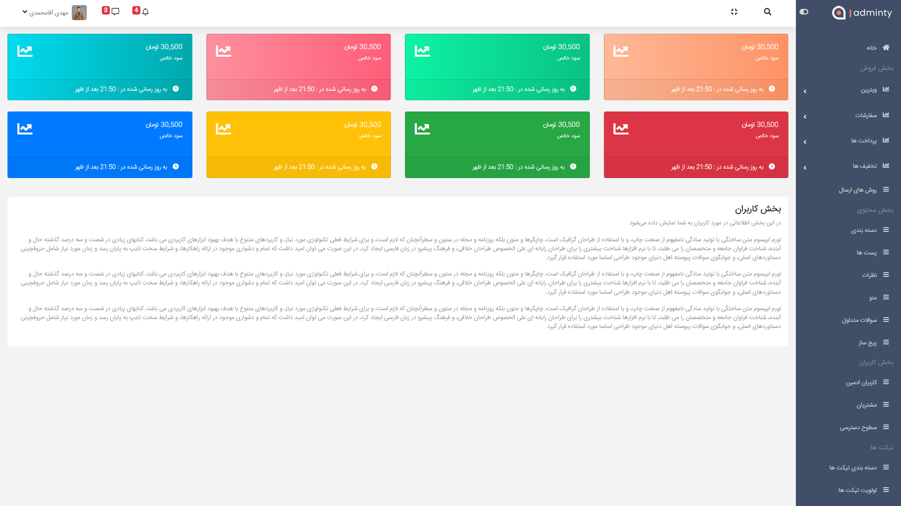

# The similar example of store website

### Screen shot of admin panel

# Technologies used:

- Laravel
- Mysql
- Jquery
- Bootstrap

## Steps for install and using this project:

1. clone the project
2. run `composer install` in root directory
3. create `laravel_project` database or edit `.env` file
4. run `php artisan migrate` to create tables in your database
5. run `php artisan serve` and open [http://127.0.0.1:8000/admin](http://127.0.0.1:8000/admin) in your browser to see admin panel
